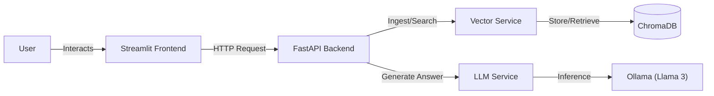

# Enterprise Intelligent Knowledge Assistant (EIKA)

**A secure, offline-first Retrieval-Augmented Generation (RAG) platform built with Python, FastAPI, and Local LLMs.**


## Project Overview

EIKA is a microservices-based AI application designed to ingest corporate documents (PDFs) and allow users to query them using natural language. Unlike standard RAG demos, EIKA is built with **production-grade architecture** in mind:

* **Microservices Pattern:** Decoupled Backend (FastAPI) and Frontend (Streamlit).
* **Pure Python Logic:** Custom sliding-window chunking and retrieval algorithms (no heavy frameworks like LangChain used for core logic).
* **Privacy First:** Runs entirely offline using local embeddings and Llama 3 via Ollama.
* **Containerized:** Fully dockerized for easy deployment.

## Architecture

The system follows a **Clean Architecture** pattern, separating the "Storefront" (API) from the "Warehouse" (Business Logic).


## Features

* **Document Ingestion:** Asynchronous processing of PDF files.
* **Semantic Search:** Uses `sentence-transformers/all-MiniLM-L6-v2` for high-speed vector retrieval.
* **Interactive Chat:** "ChatGPT-like" interface with streaming responses and history.
* **Source Citations:** Every answer cites the specific page number and paragraph context.
* **Database Management:** One-click database reset via the UI.

## Prerequisites

Before running the project, ensure you have the following installed:

1.  **Docker Desktop** (For containerized run)
2.  **Ollama** (For the LLM)
    * Download from [ollama.com](https://ollama.com)
    * Pull the model: `ollama pull llama3`
    * **Crucial:** Ensure Ollama is running in the background.

## Quick Start (Docker)

The easiest way to run EIKA is using Docker Compose. This spins up the API and UI in isolated containers.

1.  **Clone the repository**
    ```bash
    git clone [https://github.com/YOUR_USERNAME/eika-platform.git](https://github.com/YOUR_USERNAME/eika-platform.git)
    cd eika-platform
    ```

2.  **Start the services**
    ```bash
    docker-compose up --build
    ```

3.  **Access the App**
    * **Frontend (Chat):** [http://localhost:8501](http://localhost:8501)
    * **Backend (Docs):** [http://localhost:8000/docs](http://localhost:8000/docs)

*(Note: The Docker setup assumes you are running Ollama on your host machine. It connects via `host.docker.internal`.)*

## Local Development (Manual Setup)

If you prefer to run it without Docker for debugging:

1.  **Create a Virtual Environment**
    ```bash
    python -m venv venv
    # Windows:
    .\venv\Scripts\activate
    # Mac/Linux:
    source venv/bin/activate
    ```

2.  **Install Dependencies**
    ```bash
    pip install -r requirements.txt
    ```

3.  **Run the Backend (Terminal 1)**
    ```bash
    uvicorn src.main:app --reload
    ```

4.  **Run the Frontend (Terminal 2)**
    ```bash
    streamlit run src/ui/streamlit_app.py
    ```

## License

This project is open-source and available under the MIT License.